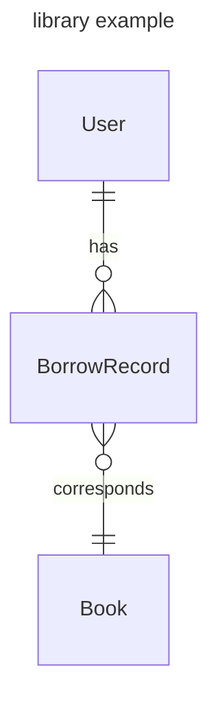

# Description
In this poc project, I will experiment TypeScript language as well as the software architecture in TypeScript.

## Problem
We need to construct a library management system in order to helper staff with their work.

A reader have to be registered before borrow books.

When a reader come to borrow a book, the stuff will check how many books the reader can borrow and then register the borrowed books in the system.

When a reader come to return a book, the stuff need to check wether the return date exceeded. if any book exceeded the return data, the reader should pay the extra fee. 

## Analyse
### Entities
- User
- Book
- BorrowRecord


### Relationships


### Models
```typescript
interface User {
    id: number;
    name: string;
}

interface Book {
    id: number;
    title: string;
    author: string;
    description?: string;
}

interface BorrowRecord {
    userId: number;
    bookId: number;
    startDate: Date;
    returnDate: Date;
}
```

## API
- Book
- User
- BorrowRecord
